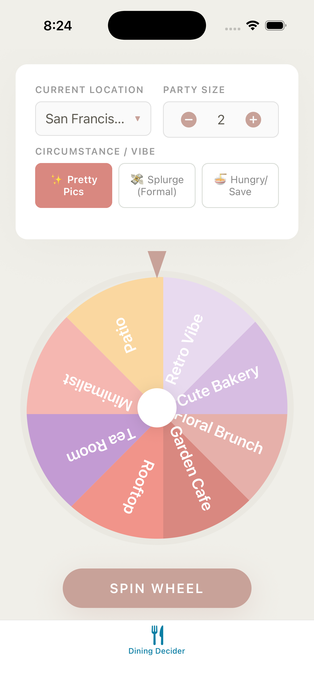

# Dining Decider

A native iOS app that solves the "where should we eat?" problem through an interactive spinning wheel interface.



## Overview

Dining Decider transforms restaurant selection into a delightful game. Instead of endless deliberation, users spin a customized wheel based on their mood, location, and party size to receive curated restaurant recommendations.

## Key Features

- **Interactive Spinning Wheel** - Drag and release to spin with physics-based momentum
- **Three Vibe Modes**
  - Pretty Pics (Aesthetic): Instagram-worthy, visually beautiful spots
  - Splurge (Formal): Upscale fine dining experiences
  - Hungry/Save (Standard): Quality food without breaking the bank
- **Location-Based Search** - Current location or manual city entry with customizable radius
- **Party Size Support** - 1-20 people with per-person pricing calculated
- **Curated Recommendations** - 3 restaurants per spin with details and directions
- **Native iOS Experience** - Haptic feedback, Apple Maps integration, SF Symbols

## Tech Stack

- **UI Framework**: SwiftUI
- **Minimum iOS**: 17.0
- **State Management**: @Observable
- **Location**: CoreLocation / MapKit
- **Haptics**: UIImpactFeedbackGenerator

## Build & Run

### Prerequisites
- Xcode 15.0+
- iOS 17.0+
- Swift 5.9+

### Commands

```bash
# Open in Xcode
open DiningDecider.xcodeproj

# Build from command line
xcodebuild -scheme DiningDecider -destination 'platform=iOS Simulator,name=iPhone 17 Pro'

# Run Core tests (fast, no simulator required, ~0.02s)
cd DiningDeciderCore && swift test

# Run all tests (requires iOS Simulator, ~30-60s)
xcodebuild test -scheme DiningDecider -destination 'platform=iOS Simulator,name=iPhone 17 Pro'

# Lint code
swiftlint  # Install: brew install swiftlint
```

## Project Structure

```
DiningDecider/                      # Main iOS app target
├── DiningDeciderApp.swift          # App entry point
├── ContentView.swift               # Main screen layout
├── Models/
│   ├── VibeMode.swift              # Vibe mode enum (wraps Core)
│   ├── WheelSector.swift           # Wheel sector with SwiftUI Color
│   └── Restaurant.swift            # Restaurant model (wraps Core)
├── Views/
│   ├── ResultsView.swift           # Restaurant results display
│   └── Components/
│       ├── SpinningWheelView.swift # Interactive wheel with drag gesture
│       ├── WheelSectorShape.swift  # Custom wheel sector shape
│       ├── ControlsCard.swift      # Settings panel container
│       ├── VibeSelector.swift      # Vibe mode toggle
│       ├── PartySizeStepper.swift  # Party size control
│       ├── RadiusPicker.swift      # Search radius selector
│       ├── LocationInputView.swift # Location entry field
│       └── RestaurantCard.swift    # Restaurant info card
├── Services/
│   ├── LocationManager.swift       # CLLocationManager wrapper
│   └── GeocodingService.swift      # Address geocoding
├── Data/
│   ├── restaurants.json            # Bundled restaurant data
│   └── RestaurantLoader.swift      # JSON loading (wraps Core)
├── Utilities/
│   ├── HapticManager.swift         # Haptic feedback provider
│   └── MapsHelper.swift            # Apple Maps URL generation
└── Extensions/
    └── Color+Theme.swift           # Design tokens & theme colors

DiningDeciderCore/                  # Pure Swift package (simulator-free tests)
├── Sources/DiningDeciderCore/
│   ├── VibeMode.swift              # Vibe enum with pure data
│   ├── Restaurant.swift            # Restaurant model + PriceLevelTag
│   ├── RestaurantLoader.swift      # JSON loading + filtering logic
│   ├── WheelSectorData.swift       # Sector data without SwiftUI
│   ├── WheelMath.swift             # Sector landing calculations
│   ├── WheelPhysics.swift          # Momentum & friction physics
│   ├── DistanceCalculator.swift    # Haversine distance formula
│   ├── LuminanceCalculator.swift   # Color contrast calculations
│   ├── ThemeColorValues.swift      # Theme hex values
│   ├── HapticTypes.swift           # Haptic type definitions
│   ├── MapsHelper.swift            # Maps URL generation
│   ├── PartySize.swift             # Party size constants
│   ├── SearchRadius.swift          # Search radius options
│   └── PriceCalculator.swift       # Price formatting utilities
└── Tests/DiningDeciderCoreTests/   # 262 fast tests (~0.02s)

DiningDeciderTests/                 # Integration tests (require simulator)
├── Services/
│   ├── LocationManagerTests.swift
│   └── GeocodingServiceTests.swift
├── Extensions/
│   ├── ColorDarkModeTests.swift
│   └── ColorLuminanceTests.swift
├── Views/
│   └── SpinningWheelViewHapticTests.swift
└── Mocks/
    ├── MockLocationProvider.swift
    ├── MockGeocodingService.swift
    └── MockHapticProvider.swift
```

## Development Workflow

This project follows **Test-Driven Development (TDD)**:
1. Write tests first before implementing features
2. Follow Red-Green-Refactor cycle
3. Maintain high test coverage across all layers

### Test Strategy: Simulator-Free First

We prioritize fast feedback loops by extracting pure Swift logic to `DiningDeciderCore`:

| Target | Tests | Execution | Purpose |
|--------|-------|-----------|---------|
| **DiningDeciderCore** | ~262 | ~0.02s | Pure logic, models, calculations |
| **DiningDeciderTests** | ~74 | ~30-60s | UIKit/SwiftUI integration only |

**Run Core tests first** during development:
```bash
cd DiningDeciderCore && swift test
```

See [CLAUDE.md](CLAUDE.md) for detailed development guidelines and [docs/MVP.md](docs/MVP.md) for comprehensive technical documentation.

## Architecture

- **Single Source of Truth**: `DiningViewModel` (@Observable) manages all app state
- **Core Package Strategy**: Pure Swift logic in `DiningDeciderCore` enables simulator-free testing
- **Physics-Based Animation**: Drag gesture captures angular velocity, momentum spin with friction-based deceleration (0.98 factor)
- **Protocol-Oriented Design**: All services use protocols for dependency injection and testability
- **Clean Code**: SOLID principles, single responsibility, small focused functions
- **Dark Mode Support**: Automatic theme adaptation with semantic colors

## Future Enhancements

- Restaurant photos with cached images
- Favorites system with SwiftData persistence
- Spin history tracking
- Home Screen widget
- Siri integration
- SharePlay for group decisions

## License

Copyright 2025. All rights reserved.
