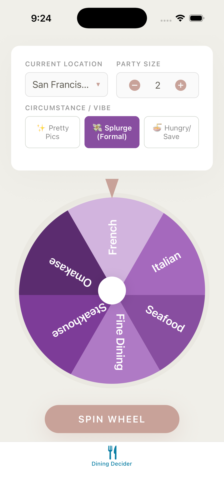
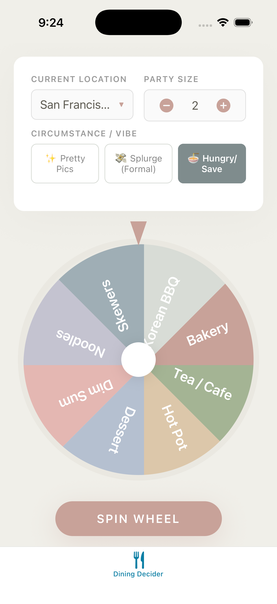

# Dining Decider - iOS Native MVP

## Overview

**Dining Decider** is a native iOS app that solves the "where should we eat?" problem through an interactive spinning wheel interface. Instead of endless deliberation, users spin a customized wheel based on their mood, location, and party size to receive curated restaurant recommendations.

**Core Problem:** Decision paralysis when choosing restaurants
**Solution:** Gamified wheel-based selection with curated restaurant data

## Screenshots

| Main Screen | Spinning | Results |
|:-----------:|:--------:|:-------:|
|  |  |  |

---

## Key Features

### Primary Features

- **Gesture-Driven Wheel**: Drag and release to spin with physics-based momentum
- **Three Vibe Modes**: Different wheel configurations based on dining occasion
  - **Pretty Pics (Aesthetic)**: Instagram-worthy, visually beautiful spots
  - **Splurge (Formal)**: Upscale fine dining experiences
  - **Hungry/Save (Standard)**: Quality food without breaking the bank
- **Location-Based Search**: Current location or manual city entry with radius selector
- **Party Size Selection**: 1-20 people (per-person pricing calculated)
- **Restaurant Recommendations**: 3 curated restaurants per spin
- **Haptic Feedback**: Native UIFeedbackGenerator integration
- **Apple Maps Integration**: One-tap navigation to restaurants

### Secondary Features

- **Category Diversity**: 8 dining categories per vibe mode (24 total)
- **Rich Restaurant Data**: Name, location, average cost, parking info
- **Dark Mode**: Automatic system appearance support
- **SF Symbols**: Native iOS iconography throughout

---

## User Flow

```
1. App Launch
   ↓
2. Location Setup:
   - Prompt for location permission
   - If granted → use current location
   - If denied → show manual city entry
   ↓
3. Default State (Current Location or "San Francisco, CA", 10 mi, Party 2, Aesthetic)
   ↓
4. User Customizes:
   - Set search radius (5/10/15/25 mi)
   - Set party size (1-20)
   - Choose vibe (Pretty Pics/Splurge/Save)
   ↓
5. User Swipes Wheel
   - Drag gesture on wheel
   - Release with velocity
   ↓
6. Wheel Spins with Momentum
   - Speed based on swipe velocity
   - Haptic feedback (start + end)
   - Natural deceleration
   ↓
7. Results Calculated
   - Landing sector determined
   - Restaurants filtered by distance & shuffled
   ↓
8. Results Sheet Presented
   - Restaurant cards with details
   - Map buttons for navigation
   ↓
9. User Options:
   a) Tap Map → Opens Apple Maps
   b) Tap Spin Again → Dismisses sheet
```

---

## Screens

### Main Wheel Screen

**Layout (top to bottom):**
1. **Controls Card**: Location display, radius picker, party size stepper, vibe selector
2. **Spinning Wheel**: Draggable wheel with colored sectors
3. **Hint Text**: "Swipe to spin" (fades after first use)

**Wheel Interaction:**
- User drags/swipes on wheel in circular motion
- Release triggers spin with momentum based on drag velocity
- Faster swipe = more rotations = longer spin
- Wheel decelerates naturally with easing

**Controls:**
- **Location Display**: Shows current location or manual entry field
  - If using current location: "📍 Current Location" with change button
  - If manual: Text field with city autocomplete
- **Search Radius**: `Picker` with options: 5 / 10 / 15 / 25 mi
- **Party Size**: `Stepper` with value display (1-20)
- **Vibe Selector**: Segmented control or custom button group

### Results Screen

**Presentation:** Sheet (`.sheet` modifier)

**Layout:**
- **Header**: Winning category title + "Recommendations" subtitle
- **Restaurant Cards** (3 cards): Each showing:
  - Restaurant name + Map button (SF Symbol: `map.fill`)
  - Category tag (Luxury/Premium/Aesthetic/Value)
  - Quoted description
  - Parking info with icon (`car.fill`)
  - Per-person price + estimated total for party
- **Spin Again Button**: Dismisses sheet

---

## Wheel Sectors by Vibe Mode

### Aesthetic Mode (8 sectors)
Instagram-worthy spots with pastel palette:
- Floral Brunch, Garden Cafe, Rooftop, Tea Room
- Minimalist, Patio, Retro Vibe, Cute Bakery

### Splurge Mode (6 sectors)
Upscale dining with jewel-tone purples:
- Seafood, Fine Dining, Steakhouse
- Omakase, French, Italian

### Standard Mode (8 sectors)
Value dining with muted earth tones:
- Tea/Cafe, Hot Pot, Dessert, Dim Sum
- Noodles, Skewers, Korean BBQ, Bakery

---

## Technical Architecture

### Tech Stack

| Category | Technology |
|----------|------------|
| UI Framework | SwiftUI |
| Minimum iOS | iOS 17.0 |
| State Management | @Observable |
| Animation | SwiftUI Animations / Core Animation |
| Graphics | SwiftUI Shape / Canvas |
| Location | CoreLocation / MapKit (geocoding) |
| Haptics | UIImpactFeedbackGenerator |
| Maps | MapKit / URL Scheme |

### Project Structure

```
DiningDecider/
├── App/
│   └── DiningDeciderApp.swift      # App entry point
├── Views/
│   ├── ContentView.swift           # Main wheel screen
│   ├── ResultsView.swift           # Results sheet
│   └── Components/
│       ├── SpinningWheelView.swift # Wheel with animation
│       ├── WheelSectorShape.swift  # Pie slice shape
│       ├── LocationInputView.swift # Location display/entry
│       ├── RadiusPicker.swift      # Search radius selector
│       ├── PartySizeStepper.swift  # Party size control
│       └── VibeSelector.swift      # Vibe mode buttons
├── Models/
│   ├── Restaurant.swift            # Restaurant model
│   ├── WheelSector.swift           # Sector definition
│   ├── VibeMode.swift              # Vibe enum
│   └── LocationMode.swift          # Current/Manual location
├── ViewModels/
│   └── DiningViewModel.swift       # @Observable state
├── Services/
│   └── LocationManager.swift       # CoreLocation wrapper
├── Data/
│   └── RestaurantData.swift        # Static restaurant database
├── Utilities/
│   ├── WheelMath.swift             # Rotation calculations
│   ├── WheelPhysics.swift          # Momentum & deceleration
│   ├── DistanceCalculator.swift    # Haversine distance
│   └── HapticManager.swift         # Haptic feedback helper
├── Extensions/
│   └── Color+Theme.swift           # Color definitions
└── Resources/
    └── Assets.xcassets             # App icons, colors
```

### State Management

```swift
@Observable
final class DiningViewModel {
    // Location
    var locationMode: LocationMode = .manual("San Francisco, CA")
    var searchRadius: Double = 10.0  // miles
    var resolvedCoordinate: CLLocationCoordinate2D?

    // Preferences
    var partySize: Int = 2
    var vibe: VibeMode = .aesthetic

    // Wheel state
    var isSpinning: Bool = false
    var currentRotation: Double = 0
    var lastWinningIndex: Int = -1

    var currentResult: SpinResult?

    func spin() async { ... }
    func resetSpin() { ... }
    func useCurrentLocation() { ... }
    func geocodeManualLocation(_ query: String) async { ... }
}
```

### Models

```swift
import CoreLocation

enum LocationMode: Equatable {
    case current(CLLocationCoordinate2D)
    case manual(String)  // City name, address, or zip
}

enum VibeMode: String, CaseIterable {
    case aesthetic
    case splurge
    case standard
}

struct Restaurant: Identifiable {
    let id = UUID()
    let name: String
    let coordinate: CLLocationCoordinate2D
    let priceLevel: Int          // 1-4
    let averageCost: Int         // Per person
    let description: String
    let parking: String
    let mapQuery: String
}

struct WheelSector: Identifiable {
    let id = UUID()
    let label: String
    let color: Color
}

struct SpinResult {
    let category: String
    let restaurants: [Restaurant]
    let timestamp: Date
}
```

---

## Design System

### Colors

```swift
extension Color {
    static let theme = ThemeColors()
}

struct ThemeColors {
    let background = Color(hex: "F0EFE9")
    let cardBackground = Color.white
    let primaryButton = Color(hex: "C8A299")
    let disabledButton = Color(hex: "DDDDDD")

    let vibeAesthetic = Color(hex: "D98880")
    let vibeSplurge = Color(hex: "884EA0")
    let vibeStandard = Color(hex: "7F8C8D")

    let wheelBorder = Color(hex: "EAE8E1")
    let title = Color(hex: "5E5B52")
    let label = Color.gray
}
```

### Typography

- **Primary**: San Francisco (system default)
- **Titles**: `.title`, `.title2` with `.bold()`
- **Body**: `.body`
- **Labels**: `.caption` with `.secondary` foreground

---

## Restaurant Data

### Data Strategy

| Phase | Approach | Notes |
|-------|----------|-------|
| MVP | Bundled JSON | Simple, offline-ready, ~50-100 restaurants |
| V2 | Remote sync | Check for updates on launch |
| Future | API integration | Yelp/Google for live data |

### File Structure

```
DiningDecider/
├── Data/
│   ├── restaurants.json        # Bundled restaurant database
│   └── RestaurantLoader.swift  # JSON decoder & query methods
```

### JSON Schema

```json
{
  "version": "1.0",
  "lastUpdated": "2025-01-15",
  "categories": {
    "Rooftop": [
      {
        "name": "RH Rooftop",
        "lat": 37.7855,
        "lng": -122.4064,
        "priceLevel": 3,
        "avgCost": 65,
        "description": "Stunning views with upscale American fare",
        "parking": "Valet available, street parking nearby",
        "mapQuery": "RH Rooftop San Francisco"
      }
    ],
    "Fine Dining": [],
    "Dim Sum": [],
    "Garden Cafe": []
  }
}
```

### Data Models

```swift
struct RestaurantData: Codable {
    let version: String
    let lastUpdated: String
    let categories: [String: [Restaurant]]
}

struct Restaurant: Codable, Identifiable {
    var id: String { name }
    let name: String
    let lat: Double
    let lng: Double
    let priceLevel: Int      // 1-4
    let avgCost: Int         // per person in USD
    let description: String
    let parking: String
    let mapQuery: String

    var coordinate: CLLocationCoordinate2D {
        CLLocationCoordinate2D(latitude: lat, longitude: lng)
    }
}
```

### RestaurantLoader

```swift
final class RestaurantLoader {
    static let shared = RestaurantLoader()

    private(set) var data: RestaurantData?

    init() {
        loadBundled()
    }

    private func loadBundled() {
        guard let url = Bundle.main.url(forResource: "restaurants", withExtension: "json"),
              let jsonData = try? Data(contentsOf: url) else { return }
        data = try? JSONDecoder().decode(RestaurantData.self, from: jsonData)
    }

    func restaurants(for category: String) -> [Restaurant] {
        data?.categories[category] ?? []
    }

    var allCategories: [String] {
        Array(data?.categories.keys ?? []).sorted()
    }
}
```

### Filtering Logic

```swift
extension RestaurantLoader {
    func filter(
        category: String,
        userLocation: CLLocationCoordinate2D,
        radius: Double,
        vibe: VibeMode
    ) -> [Restaurant] {
        restaurants(for: category)
            .filter { distanceInMiles(from: userLocation, to: $0.coordinate) <= radius }
            .filter { restaurant in
                switch vibe {
                case .splurge: return restaurant.priceLevel >= 3
                case .standard: return restaurant.priceLevel <= 2
                case .aesthetic: return true
                }
            }
            .shuffled()
            .prefix(3)
            .map { $0 }
    }

    private func distanceInMiles(
        from: CLLocationCoordinate2D,
        to: CLLocationCoordinate2D
    ) -> Double {
        let fromLoc = CLLocation(latitude: from.latitude, longitude: from.longitude)
        let toLoc = CLLocation(latitude: to.latitude, longitude: to.longitude)
        return fromLoc.distance(from: toLoc) / 1609.34
    }
}
```

### Future: Remote Sync

```swift
extension RestaurantLoader {
    func syncIfNeeded() async {
        guard let url = URL(string: "https://api.example.com/restaurants.json") else { return }

        do {
            let (data, _) = try await URLSession.shared.data(from: url)
            let remote = try JSONDecoder().decode(RestaurantData.self, from: data)

            if remote.version > self.data?.version ?? "0" {
                self.data = remote
                cacheLocally(data)
            }
        } catch {
            // Use bundled/cached data as fallback
        }
    }

    private func cacheLocally(_ data: Data) {
        let cacheURL = FileManager.default.urls(for: .cachesDirectory, in: .userDomainMask)[0]
            .appendingPathComponent("restaurants.json")
        try? data.write(to: cacheURL)
    }
}
```

### Data Coverage (MVP)

| Category | Target Count | Price Range |
|----------|--------------|-------------|
| Rooftop | 8-10 | $$-$$$$ |
| Fine Dining | 8-10 | $$$-$$$$ |
| Garden Cafe | 8-10 | $$-$$$ |
| Dim Sum | 8-10 | $-$$ |
| Hot Pot | 6-8 | $$-$$$ |
| Omakase | 5-6 | $$$$ |
| Tea Room | 6-8 | $-$$ |
| Bakery | 8-10 | $-$$ |
| ... | ... | ... |

**Total**: ~80-100 restaurants across 20+ categories

---

## Animation

### Gesture-Based Wheel Spin

```swift
struct SpinningWheelView: View {
    @State private var rotation: Double = 0
    @State private var angularVelocity: Double = 0
    @State private var lastAngle: Double = 0
    @State private var isSpinning: Bool = false

    var body: some View {
        ZStack {
            WheelContent()
                .rotationEffect(.degrees(rotation))
                .gesture(dragGesture)
        }
        .onAppear { startDecelerationTimer() }
    }

    var dragGesture: some Gesture {
        DragGesture()
            .onChanged { value in
                let center = CGPoint(x: 175, y: 175)  // wheel center
                let currentAngle = atan2(value.location.y - center.y,
                                         value.location.x - center.x)
                let angleDelta = (currentAngle - lastAngle) * 180 / .pi

                rotation += angleDelta
                angularVelocity = angleDelta * 60  // amplify for momentum
                lastAngle = currentAngle
            }
            .onEnded { value in
                // Calculate velocity from drag
                let velocity = hypot(value.velocity.width, value.velocity.height)
                angularVelocity = min(velocity / 10, 2000)  // cap max speed
                isSpinning = true
                HapticManager.shared.spinStart()
            }
    }

    func startDecelerationTimer() {
        Timer.scheduledTimer(withTimeInterval: 1/60, repeats: true) { _ in
            guard isSpinning else { return }

            rotation += angularVelocity / 60
            angularVelocity *= 0.98  // friction/deceleration

            if abs(angularVelocity) < 1 {
                isSpinning = false
                HapticManager.shared.spinEnd()
                calculateResult()
            }
        }
    }
}
```

### Velocity to Spin Duration

| Swipe Speed | Angular Velocity | Approximate Spins |
|-------------|------------------|-------------------|
| Slow flick  | ~200°/s          | 1-2 rotations     |
| Medium swipe| ~600°/s          | 3-5 rotations     |
| Fast swipe  | ~1200°/s         | 6-10 rotations    |
| Maximum     | 2000°/s (capped) | 10-15 rotations   |

### Wheel Drawing

```swift
struct WheelSectorShape: Shape {
    let startAngle: Angle
    let endAngle: Angle

    func path(in rect: CGRect) -> Path {
        var path = Path()
        let center = CGPoint(x: rect.midX, y: rect.midY)
        let radius = min(rect.width, rect.height) / 2

        path.move(to: center)
        path.addArc(
            center: center,
            radius: radius,
            startAngle: startAngle,
            endAngle: endAngle,
            clockwise: false
        )
        path.closeSubpath()

        return path
    }
}
```

---

## Haptic Feedback

```swift
final class HapticManager {
    static let shared = HapticManager()

    private let impactMedium = UIImpactFeedbackGenerator(style: .medium)
    private let notification = UINotificationFeedbackGenerator()

    func spinStart() {
        impactMedium.impactOccurred()
    }

    func spinEnd() {
        notification.notificationOccurred(.success)
    }
}
```

| Moment | Type | Purpose |
|--------|------|---------|
| Drag Start | `.light` impact | Confirms touch on wheel |
| Release/Spin | `.medium` impact | Confirms momentum transfer |
| Spin End | `.success` notification | Signals result ready |

---

## Location Services

### LocationManager

```swift
import CoreLocation

@Observable
final class LocationManager: NSObject, CLLocationManagerDelegate {
    private let manager = CLLocationManager()

    var authorizationStatus: CLAuthorizationStatus = .notDetermined
    var currentLocation: CLLocationCoordinate2D?

    func requestPermission() {
        manager.requestWhenInUseAuthorization()
    }

    func locationManagerDidChangeAuthorization(_ manager: CLLocationManager) {
        authorizationStatus = manager.authorizationStatus
        if authorizationStatus == .authorizedWhenInUse {
            manager.requestLocation()
        }
    }

    func locationManager(_ manager: CLLocationManager, didUpdateLocations locations: [CLLocation]) {
        currentLocation = locations.first?.coordinate
    }
}
```

### Geocoding (Manual Entry)

```swift
import MapKit

func geocodeAddress(_ address: String) async -> CLLocationCoordinate2D? {
    let geocoder = CLGeocoder()
    let placemarks = try? await geocoder.geocodeAddressString(address)
    return placemarks?.first?.location?.coordinate
}
```

### Location Flow

```
┌─────────────────────────────────────────────────┐
│ App Launch                                       │
└─────────────────────┬───────────────────────────┘
                      ▼
┌─────────────────────────────────────────────────┐
│ Check authorizationStatus                        │
└─────────────────────┬───────────────────────────┘
                      ▼
        ┌─────────────┴─────────────┐
        ▼                           ▼
┌───────────────┐           ┌───────────────┐
│ .notDetermined│           │ .denied       │
│               │           │ .restricted   │
└───────┬───────┘           └───────┬───────┘
        ▼                           ▼
┌───────────────┐           ┌───────────────┐
│ Request       │           │ Show manual   │
│ permission    │           │ entry field   │
└───────┬───────┘           └───────────────┘
        ▼
┌───────────────┐
│ .authorized   │ → Use current location
└───────────────┘
```

---

## Maps Integration

```swift
func openInMaps(restaurant: Restaurant) {
    // Option 1: Use coordinates directly
    let coordinate = restaurant.coordinate
    let url = URL(string: "maps://?ll=\(coordinate.latitude),\(coordinate.longitude)&q=\(restaurant.name.addingPercentEncoding(withAllowedCharacters: .urlQueryAllowed) ?? "")")

    // Option 2: Use search query
    let query = restaurant.mapQuery
        .addingPercentEncoding(withAllowedCharacters: .urlQueryAllowed) ?? ""
    let url = URL(string: "maps://?q=\(query)")

    if let url {
        UIApplication.shared.open(url)
    }
}
```

---

## Future Enhancements

### Near-Term
1. **Restaurant Photos**: AsyncImage with cached images
2. **Favorites System**: SwiftData persistence
3. **History Tracking**: Recent spins with SwiftData
4. **Share Results**: ShareLink integration

### iOS Platform Features
5. **Home Screen Widget**: Quick spin or last result
6. **App Intents / Siri**: "Hey Siri, spin the dining wheel"
7. **Live Activities**: Show spinning state on Lock Screen
8. **iCloud Sync**: Sync favorites across devices

### Advanced
9. **Yelp/Google Integration**: Live ratings and reviews
10. **Custom Wheels**: User-created categories
11. **SharePlay**: Group spin sessions with friends

---

## Requirements

- **iOS**: 17.0+
- **Xcode**: 15.0+
- **Swift**: 5.9+

---

## Summary

Dining Decider is a native iOS app that transforms restaurant selection into a delightful game. The app leverages:

- **Tactile Interaction**: Drag-to-spin wheel with physics-based momentum
- **Native Performance**: SwiftUI with smooth 60fps animation
- **iOS Integration**: SF Symbols, haptics, CoreLocation, Apple Maps
- **Privacy-Friendly**: Works with or without location permission
- **Clean Architecture**: @Observable state, MVVM pattern
- **Location-Aware**: Current location or manual entry with radius search
- **Future-Ready**: Widget, Siri, and SharePlay potential
